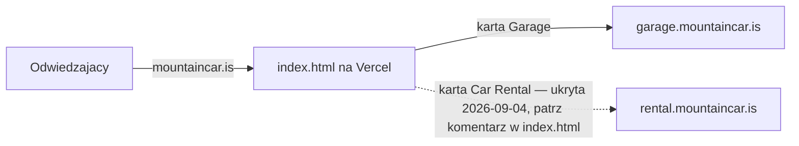

# ARCHITECTURE — mapa dla obcego (1 strona)

<!-- Cel: senior, ktory nigdy nie widzial repo, znajduje miejsce zmiany w 15 min. Aktualizuj przy kazdym ADR. -->

## Co to jest

Jednoplikowa strona-rozdzielacz dla **Mountain Car** (Iceland). Mountain Car prowadzi dwa
osobne biznesy pod jedna marka — wypozyczalnie aut i warsztat mechaniczny — kazdy na
wlasnej subdomenie. Ta strona stoi pod apex `mountaincar.is` i w jednym kliknieciu wysyla
odwiedzajacego na wlasciwa domene. Zero backendu, zero bazy danych, zero formularzy.

## Stack (boring — brak `package.json`, wiec brak wersji do sledzenia)

- Front: reczny HTML5 + CSS3 (custom properties, flex/grid, `clamp()`), zero JS.
- Fonty: Google Fonts (Montserrat + Open Sans) z CDN (`fonts.googleapis.com`).
- Obrazy (logo, tlo): hostowane na Cloudfront (`d1yei2z3i6k35z.cloudfront.net`) — nie w repo.
- Hosting: Vercel, `vercel.json` (`cleanUrls`, brak trailing slash). Deploy = `git push` na
  `main`. Zobacz `docs/adr/0001-static-hosting-vercel-not-lovable.md`.
- Testy: Playwright (`e2e/smoke.spec.ts`) — scaffolding istnieje, ale nie jest jeszcze
  podpiety pod runner. Zobacz `docs/quality/BACKLOG.md`.

## Moduly i granice (co jest gdzie)

| Plik | Odpowiedzialnosc | Tier |
|---|---|---|
| `index.html` | caly produkt: markup + `<style>` inline + tresc | T1 |
| `vercel.json` | konfiguracja hostingu (czyste URL-e) | T1 |
| `e2e/smoke.spec.ts` | dymny test: strona renderuje sie, konsola bez bledow | T1 |
| `.github/workflows/quality.yml` | CI: build/lint/typecheck/test/build sa self-skip bez `package.json`; Semgrep i Gitleaks zawsze dzialaja | — |
| `.github/workflows/claude-review.yml` | recenzja PR przez Claude (wymaga `CLAUDE_CODE_OAUTH_TOKEN`; bez sekretu pomija sie) | — |

Nie ma katalogow `src/`, `lib/`, `features/` — cala "logika biznesowa" to routing dwoma
linkami `<a href>` w markupie. Gdy to przestanie wystarczac, to sygnal do zmiany
architektury (nowy ADR), nie do dopisywania JS obok.

## Przeplyw (diagram)

## Gdzie jest…

- **Tresc/copy:** wprost w `index.html`, wewnatrz `
`.
- **Kolory/styl:** `:root` w bloku `<style>` (`--primary`, `--accent`, `--white`).
- **Logo/tlo:** URL-e Cloudfront w `index.html` (``, `.bg { background-image }`) —
  aktywa nie sa zcommitowane do repo.
- **Routing miedzy biznesami:** dwie karty `<a class="card">`; karta Car Rental jest
  aktualnie zakomentowana (wypozyczalnia zamknieta od 2026-09-04 — patrz komentarz w kodzie
  tuz nad nia, ktory tlumaczy jak ja przywrocic).
- **Sekrety:** brak — strona nie ma backendu ani klucza do przechowania.
- **CI/bezpieczenstwo:** `.github/workflows/` — patrz tabela wyzej.

## Decyzje nieodwracalne

`docs/adr/0001-static-hosting-vercel-not-lovable.md` — dlaczego statyczny plik na Vercelu,
nie aplikacja w Lovable.

## Jak to cofnac / kill switch

Zla zmiana na produkcji: `git revert <sha-zlego-commita> && git push` na `main` — Vercel
przebuduje z poprzedniej tresci w ciagu sekund. Nic do rollbackowania po stronie bazy/infra,
bo ich nie ma.
